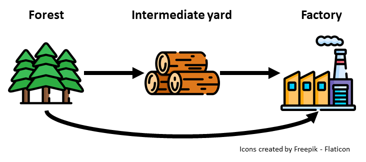
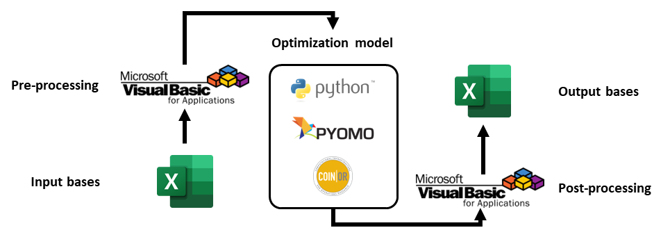

# Wood Transportation Planning

The aim of this project was to create a tool to plan the logistics of wood transportation in the production chain of a paper manufacturing company.

Paper is made from wood, which has to be transported from the forest to the factories, sometimes going through intermediate yards.

This process is complex because it involves crucial (and costly) aspects, such as:

- Current stock levels in the forest, intermediate yards, and factories.
- Specificities of the demand at the factories (e.g., type of product, wood density, and wood age).
- Accessibility to roads, depending on weather conditions.
- Desired stock levels (minimum and maximum) in intermediate yards and factories.
- Desired transportation amounts (minimum and maximum) for specific origin-destination pairs.

Once a transportation plan is ready, a large number of trucks must be designated to pick up and deliver loads. This is done on a daily basis and is a procedure that is revised and refined as needed.

To assist in the planning of this process, a tool was created with the following structure:

- An Excel file containing all input data (stocks and demands).
- Another Excel file, which provides an interface for the user to analyze the inputs and make adjustments to the constraints of the plan.
- A transportation linear programming model that balances stocks in all locations and for all periods of the plan (written in Python and compiled to an executable file).
- A final Excel file, with the output data (transportation plan and projected stocks).

The pre-processing of the input data and post-processing of the output data are done using VBA. The optimization model was written in Python using Pyomo and [COIN-OR](https://www.coin-or.org/)'s free solver CBC. (No commercial solver was necessary because the solve time is very short, usually less than 5 seconds.)

In short, the optimization model aims to minimize deviations across all its constraints, while adhering to stock balancing equations for all products and throughout all periods.

This tool is used on a daily basis by PPC personnel to plan the transportation of around 200,000 tons of wood weekly. The Python code comprises a little over 3000 lines, and the VBA code, which is divided into several macros, totals around 4000 lines. Since it was created for commercial purposes, it cannot be made publicly available.

